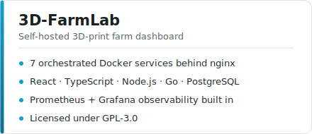

<div align="center">


# 3D-FarmLab

**A self-hosted dashboard for running a 3D-print farm** — live printer monitoring, a public print-request queue, role-based access, and Prometheus/Grafana analytics, all in one Docker Compose stack.

[](https://github.com/saralray/3D-FarmLab)

[](LICENSE)
[](https://github.com/saralray/3D-FarmLab/actions/workflows/deploy.yml)


<a href="https://github.com/saralray/3D-FarmLab">
  
</a>

[](https://github.com/saralray/3D-FarmLab/pulls)
[](https://hub.docker.com/r/saralray/printfarm-web)

</div>

---

<details>
<summary><strong>📖 Table of contents</strong></summary>

- [Overview](#-overview)
- [Features](#-features)
- [Quick Start](#-quick-start)
  - [Production deploy + one-click updates](#production-deploy--one-click-updates-optional)
  - [Frontend-only development](#frontend-only-development)
- [Architecture](#-architecture)
- [Environment](#-environment)
- [Viewer Mode](#-viewer-mode)
- [Printer Profiles](#-printer-profiles)
- [Preventive Maintenance](#-preventive-maintenance)
- [Home Assistant Integration](#-home-assistant-integration)
- [Real-Time Events & Network Usage](#-real-time-events--network-usage)
- [Print Request Form](#-print-request-form)
- [Queue Behavior](#-queue-behavior)
- [Notifications](#-notifications)
- [Slicer Proxy](#-slicer-proxy)
- [API Keys and `/api/v1`](#-api-keys-and-apiv1)
- [Monitoring (Prometheus + Grafana)](#-monitoring-prometheus--grafana)
- [Image builds (CI)](#-image-builds-ci)
- [Validation](#-validation)
- [Notes](#-notes)

</details>

---

## 📋 Overview

3D-FarmLab gives staff a single dashboard to monitor every printer, manage the job queue, and track usage — while a **public viewer mode** hides sensitive connection details for anyone outside the team. It runs as seven small Docker services behind nginx: a React SPA, a Node API, PostgreSQL, a Go poller, a Go Prometheus exporter, an OctoPrint-compatible slicer proxy, and Prometheus itself.

## ✨ Features

<table>
<tr>
<td width="50%" valign="top">

**Monitoring & Control**
- Live dashboard: status, webcam previews, job progress, drag-and-drop ordering
- Printer detail pages: temps, filament, print-time tracking, role-based controls
- Multi-profile support: generic HTTP, Snapmaker U1 (Moonraker), Bambu Lab A1 Mini & H2 series (MQTT + camera streaming)
- Pause/resume/cancel, temperature setpoints, jog/motion, chamber light

</td>
<td width="50%" valign="top">

**Queue & Requests**
- Public `/request` form — no login — with STL/3MF/OBJ/STEP/G-code/ZIP upload
- Files stored directly in PostgreSQL, no external storage
- Printed-status tracking, soft deletion, history
- Discord webhook notifications on submission and printer events

</td>
</tr>
<tr>
<td width="50%" valign="top">

**Access & Integration**
- Role-aware accounts: admin, operator, viewer, read-only SSO student role
- SSO via Google, Microsoft Entra ID / AD FS, or SAML 2.0
- OctoPrint-compatible slicer proxy (Orca / PrusaSlicer / Cura)
- Programmatic `/api/v1` REST API gated by scoped API keys
- Bidirectional Home Assistant bridge — printer-status → HA service calls, HA entity states → printer commands

</td>
<td width="50%" valign="top">

**Operations**
- Preventive maintenance tracking: per-printer health score, auto-created service tasks by print-hour interval
- One-click admin software update (Watchtower-backed) with version/commit comparison
- Real-time events over SSE (`/api/events`) — new-job and maintenance toasts without polling
- Network usage analytics page — traffic by route, live throughput, poller bandwidth
- Prometheus exporter + ready-to-import Grafana dashboard
- Manager access-request workflow with admin approval

</td>
</tr>
</table>

## 🚀 Quick Start

```bash
# 1. Copy env defaults and review the values
cp .env.example .env

# 2. Set production secrets in .env — use a long random POSTGRES_PASSWORD

# 3. Start the full stack
docker compose up --build
```

Open **http://localhost:8080**. On first run, visit `/login` to complete one-time admin password setup — there is no shipped default password.

> **Optional SSO** — admins can enable Google, Microsoft Entra ID / AD FS, and/or SAML 2.0 sign-in under Settings → Sign-in. Anyone who signs in via SSO gets the read-only **student** role. See [API.md](API.md#sso-sign-in-api-apiauth) for redirect URIs.

### Production deploy + one-click updates (optional)

An additional `docker-compose.deploy.yml` overlay adds a **Watchtower** sidecar so admins can check for and apply new images from Settings → Maintenance without shelling into the host:

```bash
docker compose -f docker-compose.yml -f docker-compose.deploy.yml up --build -d
```

Configure in `.env`: `IMAGE_PREFIX` (the Docker Hub namespace CI pushed images under), `UPDATE_CHECK_REPO` (`owner/repo`, so the admin update card can diff the running commit against the latest on GitHub), and `WATCHTOWER_TOKEN` (a shared secret — leave empty to hide the one-click apply button and keep update *checking* without allowing *applying*). On a rootless-Docker host, also set `WATCHTOWER_DOCKER_SOCK` to the per-user socket.

### Frontend-only development

```bash
npm install
npm run dev       # http://localhost:5173
npm run build     # TypeScript validation + production build
npm run preview
```

Use Docker Compose whenever you need PostgreSQL, the Node middleware, nginx, and the poller running together.

## 🏗️ Architecture

```
Browser → nginx:8080 → Node web
                          ├── static SPA
                          ├── /api/printers, /api/queue, /api/analytics, /api/notifications
                          ├── /__printer_proxy/*   → printer hardware HTTP
                          └── /__printer_webcam/*  → printer webcam stream
```

| Service | Tech | Role |
|---|---|---|
| `web` | Node.js 20 | Serves the SPA, hosts all `/api/*` endpoints, proxies printer HTTP/webcam traffic |
| `db` | PostgreSQL 16 | Printers, queue jobs, analytics, webhooks |
| `poller` | Go 1.22 | Polls each printer, upserts live state into `db` |
| `slicer-proxy` | Node.js 20 | OctoPrint-compatible upload endpoint for slicers |
| `nginx` | Nginx 1.27 | Reverse proxy, security headers, TLS termination point |
| `exporter` | Go 1.22 | Read-only Prometheus exporter (`printfarm_*` metrics) |
| `prometheus` | Prometheus 2.55 | Scrapes the exporter, served at `/prometheus` |

<details>
<summary><strong>Repository layout</strong></summary>

| Path | Contents |
|---|---|
| `src/` | React, Vite, TypeScript, Tailwind, Radix UI, lucide icons |
| `server/` | Node API middleware used by the `web` container |
| `go-services/` | Go poller + exporter (`cmd/poller`, `cmd/exporter`) |
| `poller/`, `exporter/` | Original Python services, retained for reference |
| `monitoring/` | Prometheus scrape config + importable Grafana dashboard |
| `docker-compose.yml` | Full local stack |

</details>

## ⚙️ Environment

Key settings in `.env.example`:

| Variable | Purpose |
|---|---|
| `POSTGRES_DB` / `POSTGRES_USER` / `POSTGRES_PASSWORD` | Database credentials |
| `HTTP_PORT` | Public nginx port (default `8080`) |
| `VITE_PUBLIC_VIEWER_MODE` | Start the app in public viewer mode |
| `PRINTER_POLL_INTERVAL_MS` | Poller cycle interval |
| `PRINTER_REQUEST_TIMEOUT_MS` | Per-printer HTTP timeout |
| `PRINTER_OFFLINE_GRACE_SECONDS` | Delay before a printer is marked offline / notified |
| `PROMETHEUS_PORT` | Host port for Prometheus (default `9090`) |
| `EXPORTER_PORT` | Internal metrics-exporter port (default `9180`) |
| `IMAGE_PREFIX`, `UPDATE_CHECK_REPO`, `WATCHTOWER_TOKEN` | Production deploy overlay (`docker-compose.deploy.yml`) — one-click admin software updates |
| `PRINTER_SECRET_KEY` | AES-256-GCM key to encrypt printer connection secrets at rest (must match across `web`, `slicer-proxy`, `poller`) |
| `REDIS_URL` | Optional Redis cache/shared-counter in front of Postgres; degrades gracefully if unset |

The `web`, `poller`, and `exporter` services derive `DATABASE_URL` from the PostgreSQL values in `docker-compose.yml`. Most other tunables (poll intervals, timeouts, log level, CSP/HSTS, sharding) have working defaults baked into `docker-compose.yml` — see the comments in `.env.example` before adding new variables.

## 👀 Viewer Mode

Set `VITE_PUBLIC_VIEWER_MODE="true"` to start the app in public viewer mode:

- the app auto-enters a viewer session
- printer list responses redact IP address, API key header state, and profile
- the sidebar viewer profile UI is hidden
- viewers can monitor jobs but cannot pause, resume, cancel, remove, or reorder printers

## 🖨️ Printer Profiles

| Profile | Connection | Camera |
|---|---|---|
| **Generic** | HTTP reachability ping | — |
| **Snapmaker U1** | Moonraker HTTP API — temperature, motion, chamber light | MJPEG stream |
| **Bambu Lab A1 Mini** | Persistent MQTT-over-TLS (port 8883); requires serial + LAN access code + LAN Mode | Still snapshots over raw TLS (port 6000) |
| **Bambu H2 series** (H2S, H2D) | Same MQTT connection as A1 Mini | RTSP-over-TLS (port 322) via a per-printer ffmpeg hub — live MJPEG + snapshots, with stall detection and auto-restart |

## 🔧 Preventive Maintenance

Printers accumulate `totalPrintHours` and `currentNozzleHours` as jobs finish; a background worker auto-creates a pending maintenance task whenever an interval is crossed (never duplicated while one is open) and recomputes a rolling **health score** (0–100) every 5 minutes.

- Fleet-wide summary widget: printers requiring maintenance, overdue tasks, average health, total fleet hours
- Per-printer view: hours, health, pending/completed tasks, next service due
- Admin-configurable default intervals per maintenance type (Settings → Maintenance)
- Completing a task resets the relevant hour counter (e.g. nozzle hours after a nozzle service)

## 🏠 Home Assistant Integration

Admins can connect the dashboard to a Home Assistant instance (base URL + long-lived access token, encrypted at rest and never returned to the browser). Beyond device/entity discovery, print-farm-side **automation rules** bridge the two systems in both directions:

- `printer_to_ha` — call an HA service when a printer reaches a given status
- `ha_to_printer` — send a printer command (pause/resume/cancel) when an HA entity reaches a given state

Rules are evaluated by a background engine (default every 15s) and only fire on a transition into the target value, not on the initial baseline read.

## 📡 Real-Time Events & Network Usage

- **`GET /api/events`** is a public Server-Sent Events stream that pushes new-queue-job toasts to everyone and maintenance-due notifications to admins/operators instantly, replacing the old 10s/30s polling loops (a slower backstop poll remains for maintenance alerts in case of a dropped connection).
- The admin-only **Network Usage** page graphs app-layer traffic by route category (webcam, printer proxy, `/api/v1`, static, etc.), a live bytes/sec throughput indicator, and the poller's own bandwidth to the printers themselves (HTTP/MQTT/FTP), split by shard.

## 📝 Print Request Form

Students submit jobs at **`/request`** — public, no login required:

- contact info and job details
- file upload: STL, 3MF, OBJ, STEP, G-code, or ZIP, up to 50 MB

Files are stored directly in PostgreSQL and appear in the staff queue immediately; submission fires Discord notifications to configured webhooks. Staff download files from the queue view.

## 📥 Queue Behavior

- Requests come from the in-app `/request` form only — no Google Sheet sync.
- Only the 3D-print form type is shown in the queue.
- Marking a job printed moves it from the active queue into history.
- Admin deletion is a soft delete; operators mark printed, admins delete.
- Jobs and model files can be migrated between instances via `/api/v1/queue/export` and `/api/v1/queue/import`.

## 🔔 Notifications

| Channel | Behavior |
|---|---|
| **In-app bell** | Real-time printer events (offline, online, errors) and pending manager access requests for admins to approve/deny |
| **Discord webhooks** | Fires on queue submissions and printer events; managed in Settings → Notifications |

## 🖇️ Slicer Proxy

The `slicer-proxy` service emulates the OctoPrint HTTP API so Orca, PrusaSlicer, or Cura (host type "OctoPrint") can push a sliced file straight to a printer and auto-start it.

- Base URL per printer: `http://<domain>/printers/<printerId>`
- Authenticate with `X-Api-Key`; mint keys in Settings → API Keys (admin only)
- Keys carry scopes (`slicer_upload`, `printfarm_manage`) — uploads require `slicer_upload`
- Dispatch by profile: Snapmaker U1 → Moonraker upload; Bambu → FTPS upload + MQTT `project_file` command

Opening the slicer's "Device" tab redirects to the dashboard's printer-management page and grants an operator session.

## 🔑 API Keys and `/api/v1`

API keys are minted in Settings → API Keys and stored as sha256 hashes (plaintext shown once). A key with the `printfarm_manage` scope gives full read/write access to the programmatic API:

<details>
<summary><strong>Resource reference</strong></summary>

| Resource | Capabilities |
|---|---|
| **Printers** | list, get, upsert, delete, send commands (Bambu MQTT), raw proxy passthrough (`/printers/:id/proxy/<path>`) |
| **Queue** | list, upsert, mark printed, delete, reset, bulk delete, export/import for migration |
| **Analytics** | daily rollups, reset |
| **Maintenance** | list events, fleet/per-printer summaries, mark a task complete |
| **Notifications** | Discord webhook CRUD |
| **Slicer keys** | list, mint, revoke |
| **Audit logs** | read, append |
| **Settings** | per-key app settings GET/PUT (branding, integrations, layouts, HA, maintenance intervals) |
| **Users** | staff account CRUD (list, create, delete, change password) |
| **Admin credential** | get configured status, set/reset password hash, verify |
| **Manager access requests** | list, approve, deny, delete requests for elevated (operator) access |

</details>

Pass the key via `X-Api-Key` header or `Authorization: Bearer <key>`. Missing key → `401`; missing scope → `403`. Full reference: **[API.md](API.md)**.

## 📊 Monitoring (Prometheus + Grafana)

The stack ships a read-only **exporter** and a **Prometheus** server so you can graph and alert on print-farm activity in your own Grafana.

- `exporter` reads PostgreSQL on every scrape, exposing `printfarm_*` metrics on `:9180/metrics`. Internal only — never proxied through nginx.
- `prometheus` scrapes it every 15s and stores the series; nginx serves it at `/prometheus` on the main site.

Metrics cover per-printer status/temperature/progress, fleet counts, cumulative and daily job/print-hour/filament totals, and queue depth. Connection secrets (IP, API key, serial) are never emitted.

<details>
<summary><strong>Connect your Grafana</strong></summary>

**Provision it (recommended):** mount the datasource file and restart:

```bash
-v /path/to/monitoring/grafana/provisioning/datasources:/etc/grafana/provisioning/datasources:ro
```

Edit `url` in `monitoring/grafana/provisioning/datasources/prometheus.yml` first — use `http://prometheus:9090/prometheus` if Grafana shares this Docker network, or `http://<host>:HTTP_PORT/prometheus` otherwise.

**Or add it in the UI:** Connections → Data sources → add **Prometheus** with the same URL.

Then import `monitoring/grafana-dashboard.json` (Dashboards → New → Import) and pick the **Print Farm Prometheus** data source.

</details>

## 🏭 Image builds (CI)

This repo is designed to be forked and deployed by anyone — **no secrets or deployment-specific URLs are committed**. Every push to `main` triggers `.github/workflows/deploy.yml`, which builds the custom images and pushes them to Docker Hub.

Configure these under **Settings → Secrets and variables → Actions**:

| Type | Name | Purpose |
|---|---|---|
| Secret | `DOCKERHUB_USERNAME` | Push username; also the image prefix |
| Secret | `DOCKERHUB_TOKEN` | Docker Hub access token |
| Variable | `PUBLIC_VIEWER_MODE` (default `false`) | Set `true` to ship a public viewer build |

## ✅ Validation

There is no dedicated test script. Frontend validation:

```bash
npm run build
```

Full-stack smoke test:

```bash
docker compose up --build
```

Then confirm the app loads at `http://localhost:8080`, `/healthz` returns `{"ok":true}`, and the dashboard, queue, analytics, settings, and printer detail views render without console errors.

## 🔒 Notes

- `.env` is intentionally git-ignored and should never be committed.
- Put TLS in front of nginx for public deployments (a cloud/load-balancer certificate or a local TLS reverse proxy).
- Keep sensitive printer connection details out of public viewer flows.
- The `/request` print form is intentionally public so students can submit jobs without accounts.

---

<div align="center">

Released under the **[GNU General Public License v3.0](LICENSE)**.

</div>
