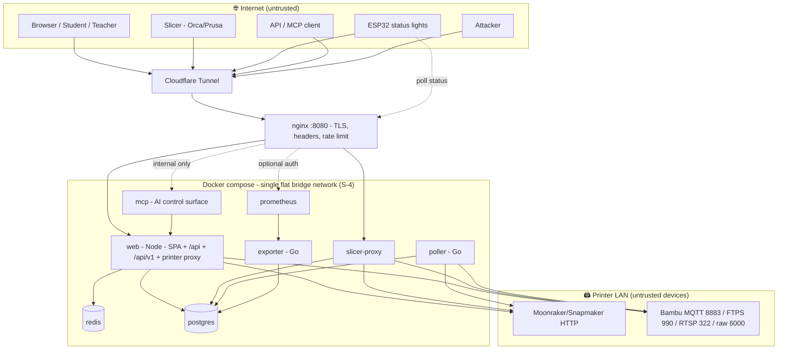
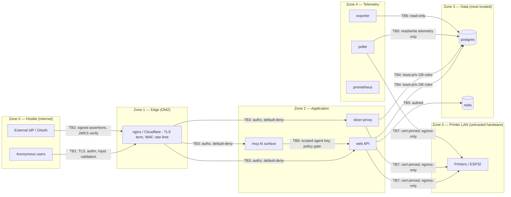
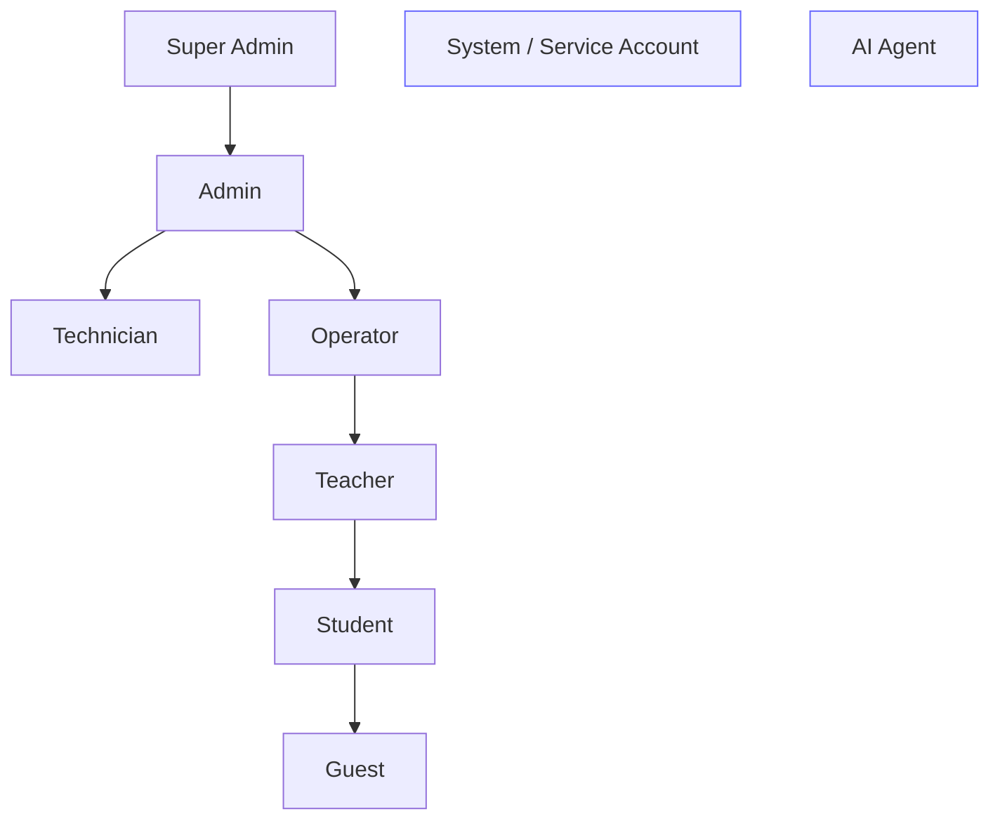

# PrintFarm — Security Architecture & Hardening Plan

> **Document type:** Security Assessment, Threat Model, and Refactoring Roadmap
> **Audience:** Maintainers, operators, and future contributors
> **Status:** Design/assessment deliverable. Code changes are proposed here and
> tracked in the [Security Roadmap](#7-security-roadmap); they are *not* all
> implemented by this document. Where this plan conflicts with the current
> architecture, **security wins** and the required refactor is described inline.
> **Relationship to `SECURITY_AUDIT.md`:** that file is the point-in-time bug
> list (C/H/M/L findings, many already fixed). *This* file is the forward-looking
> architecture: trust boundaries, the target authn/authz model, and the plan to
> get the platform to a production-grade, internet-exposed, multi-tenant posture.

---

## Table of contents

1. [Security Assessment (executive summary)](#1-security-assessment)
2. [Threat Model](#2-threat-model)
3. [Architecture Diagram](#3-architecture-diagram)
4. [Trust Boundary Diagram](#4-trust-boundary-diagram)
5. [Authentication Flow (target design)](#5-authentication-flow)
6. [Authorization Model (target RBAC)](#6-authorization-model)
7. [Security Roadmap](#7-security-roadmap)
8. [High-Priority Vulnerabilities](#8-high-priority-vulnerabilities)
9. [Medium-Priority Vulnerabilities](#9-medium-priority-vulnerabilities)
10. [Low-Priority Improvements](#10-low-priority-improvements)
11. [Refactoring Plan](#11-refactoring-plan)
12. [Secure Coding Guidelines](#12-secure-coding-guidelines)
13. [Deployment Hardening Checklist](#13-deployment-hardening-checklist)
14. [Penetration Testing Checklist](#14-penetration-testing-checklist)
15. [DevSecOps Recommendations](#15-devsecops-recommendations)
16. [Disaster Recovery Recommendations](#16-disaster-recovery)
17. [Incident Response Plan](#17-incident-response-plan)
18. [Future Security Improvements](#18-future-security-improvements)
- [Appendix A — OWASP mapping (Top 10 / API Top 10 / ASVS / Proactive Controls)](#appendix-a--owasp-mapping)

---

## 1. Security Assessment

### 1.1 What the platform is

PrintFarm is a multi-service 3D-print-farm manager. Eight containers behind a
single nginx reverse proxy (`docker-compose.yml`): `web` (Node, the API + SPA +
printer proxy), `db` (Postgres 16), `poller` (Go), `slicer-proxy` (Node), `mcp`
(Node, the LLM control surface), `exporter` (Go) + `prometheus`, and `nginx`.
The system talks to physical printers (Snapmaker/Moonraker, Bambu MQTT/FTPS/RTSP)
and to ESP32 status lights. The stated future direction — AI-driven scheduling,
automatic printer assignment, remote management, multi-school/multi-org exposure
to the internet — **materially raises the risk profile** and is the lens this
assessment uses.

### 1.2 Current security posture — the good

The codebase is well above average for a hobby-origin project. Verified in code:

- **Parameterized SQL everywhere** (`server/postgres.js`, Go `pgx`) — no
  injection surface found.
- **scrypt password hashing** with transparent upgrade from legacy sha256.
- **AES-256-GCM** for printer secrets at rest (`server/secretCrypto.js`,
  `PRINTER_SECRET_KEY`).
- **Server-side sessions**, cookie value stored as sha256; `SameSite=Lax`.
- **CSRF origin check** on cookie-authenticated mutations (`isSameOriginWrite`,
  `server/app.js:2221`).
- **Default-deny authorization**: unclassified mutations fall through to `admin`
  (`classifyApiRequest`, `server/app.js:2209`).
- **Constant-time comparisons** for credentials/HMAC.
- **G-code allowlisting** before publishing Bambu MQTT commands.
- A real **security process**: `SECURITY.md`, `SECURITY_AUDIT.md`, a runbook.

### 1.3 The core structural risks

Despite the above, the architecture carries **five systemic issues** that a
multi-tenant, internet-exposed deployment cannot ship with:

| # | Systemic risk | Why it matters at internet scale |
|---|---------------|----------------------------------|
| S-1 | **Large unauthenticated `/api/*` surface.** The whole frontend API is "cookieless/public" by design; auth is opt-in per route via `classifyApiRequest`. | Every new route is public *by omission* until someone classifies it. This is a fail-open pattern for reads. It already produced N-1 (queue file leak) and the `/__printer_proxy` bypass (C-1). |
| S-2 | **Coarse authorization.** Effective roles are `public / authed / operator / admin` — four tiers, no tenant scoping. | Cannot express "Teacher of School A sees only School A". No RBAC hierarchy, no per-object ownership, no tenant isolation. Blocks multi-org entirely. |
| S-3 | **A single "god" API scope.** `printfarm_manage` grants full read/write across *every* resource, is un-redacted (returns printer secrets), and is the key the AI/MCP layer forwards. | One leaked key = total farm compromise, including printer LAN codes. No least-privilege, no per-tool scoping for the AI agent. |
| S-4 | **Flat container network, no runtime hardening.** `docker-compose.yml` defines no custom networks, no `user:`, no `cap_drop`, no `read_only`, no `no-new-privileges`. Containers run as root by default. | A single RCE (e.g. via ffmpeg, busboy, a dependency) escalates to root-in-container on a flat network that can reach Postgres, Redis, and every printer. |
| S-5 | **Printers and the AI agent are trusted more than they should be.** TLS verification is disabled to Bambu devices (H-2); the AI/MCP layer forwards a full-power key and can call the raw printer proxy. | Spoofed printer telemetry drives analytics/AI decisions; prompt injection into the AI agent becomes a path to real printer commands. |

Everything in this document flows from remediating S-1 … S-5 while preserving the
things the project already does well.

### 1.4 Overall rating

For the **current single-org, LAN/VPN-fronted** deployment: **moderate** risk,
acceptable with the hardening checklist in §13.
For the **stated future** (internet-exposed, multi-school, AI-driven): **high**
risk until S-1…S-5 are addressed. The roadmap in §7 sequences that work.

---

## 2. Threat Model

Methodology: STRIDE per component, across the trust boundaries in §4. Risk =
Likelihood × Impact, rated Low/Medium/High/Critical. "Status" notes where a
control already exists (many do — see `SECURITY_AUDIT.md`).

### 2.1 Attack-surface inventory

External (internet-reachable through nginx): SPA, `/api/*` frontend API,
`/api/v1` key API, `/printers/` slicer proxy, `/__printer_proxy` &
`/__printer_webcam`, `/mcp`, `/prometheus`, login/SSO/OAuth endpoints, public
intake (`/api/queue/submit`, `/api/manager/request`).
Internal (compose network): Postgres, Redis, exporter, prometheus, poller,
inter-service HTTP.
Physical/adjacent: printer LAN protocols (MQTT 8883, FTPS 990, RTSP 322, raw TLS
6000, Moonraker HTTP), ESP32 status-light polling.

### 2.2 Component threat tables

#### A. Authentication (`/api/auth/*`, sessions, SSO/OAuth/SAML)

| Threat (STRIDE) | Attack | Risk | Mitigation (current → target) |
|---|---|---|---|
| Spoofing | Credential stuffing / brute force | High | scrypt + per-IP & per-user lockout + Redis counter *(present)* → add MFA (§5), breached-password check, CAPTCHA on lockout |
| Spoofing | Rate-limit bypass via `X-Forwarded-For` | High | Fixed (C-2): prefer `X-Real-IP`/rightmost XFF. **Set `set_real_ip_from` + `real_ip_header` in nginx** so app trusts only the proxy hop |
| Tampering | SAML asserts `role=admin` | High | H-6: don't trust IdP role; default new SSO users to lowest role, map roles via server-side allow-list |
| Repudiation | No audit on verify endpoints | Medium | L-4: audit every credential check, success and failure |
| Info disclosure | JWT in localStorage (if JWT added) | High | **Never** store tokens in JS-readable storage — use `HttpOnly` cookies (§5) |
| Elevation | First-run admin-credential endpoint permanently public | Medium | M-5: one-time setup token printed to stdout, TOCTOU-safe |

#### B. Frontend API (`/api/*`)

| Threat | Attack | Risk | Mitigation |
|---|---|---|---|
| Tampering | New route ships unauthenticated (fail-open) | High | **S-1 refactor**: invert to default-deny (§11.1) |
| Info disclosure | Enumerate reads that leak PII/model files | Medium | N-1 fixed; make viewer-gating the default, allowlist truly-public reads |
| DoS | Unthrottled public intake (`/queue/submit`, `/manager/request`) | Medium | M-2: per-IP quota + `429`; cap DB storage growth |
| CSRF | Cross-site cookie write | Low | `SameSite=Lax` + origin check *(present)* |

#### C. Database (Postgres)

| Threat | Attack | Risk | Mitigation |
|---|---|---|---|
| Info disclosure | Single superuser role for all services | High | **Per-service least-privilege DB roles** (§5/§11.4): poller = R/W on telemetry only; exporter = read-only; web = full |
| Tampering | Direct DB reach from a compromised co-located container | High | S-4 network segmentation; Postgres on a DB-only network |
| Info disclosure | Secrets/PII at rest unencrypted beyond printer codes | Medium | Encrypt submitter PII columns; consider Postgres TDE/volume encryption; RLS for multi-tenant (§11.4) |
| Repudiation | No tamper-evident audit trail | Medium | Append-only audit log, shipped off-box (§12, §17) |

#### D. Printer Proxy & printer protocols

| Threat | Attack | Risk | Mitigation |
|---|---|---|---|
| Spoofing | Fake printer returns forged status/telemetry | High | **Treat printers as untrusted (§9).** Validate/clamp telemetry; pin device identity (H-2) |
| Tampering | MITM on printer LAN (TLS verify off) | High | H-2: pin self-signed cert fingerprint on first connect |
| Elevation | SSRF via admin-set printer URL / SAML test | High | H-3 + L-3: block RFC1918/loopback/link-local/metadata; allowlist printer address space |
| Info disclosure | Proxy leaks internal error/IP to client | Medium | M-7: generic upstream error to client, detail to logs |
| Elevation | Anonymous control via `/__printer_proxy` | Critical | C-1 fixed (operator/admin gate). Keep the *fail-open path bug class* closed via §11.1 |
| Replay | Replayed print/cancel command | Medium | Nonce/sequence on control commands; audit + confirm (§9) |

#### E. AI Agent / MCP (`/mcp`, `mcp/`)

| Threat | Attack | Risk | Mitigation |
|---|---|---|---|
| Tampering | Prompt injection via queue names, printer names, model metadata, Discord content | High | **Never let model-controlled text become a privileged action without a policy gate (§10).** Structured tool I/O, no free-form command passthrough |
| Elevation | Agent forwards full `printfarm_manage` key → raw printer proxy / user CRUD / key mint | Critical | **Least-privilege agent identity**: a dedicated `ai_agent` role + narrowly-scoped tools (§6/§10). Remove `printer_proxy`/`printfarm_admin_request` from the agent's reachable set or gate behind human confirmation |
| Info disclosure | Agent returns printer secrets / user hashes in a tool result | High | Redact secrets on the `/api/v1` path when the caller is the agent identity |
| Repudiation | Actions attributed to "api" generically | Medium | Per-session key binding *(present for HTTP transport)*; extend to per-tool audit with agent identity |

#### F. Docker / runtime

| Threat | Attack | Risk | Mitigation |
|---|---|---|---|
| Elevation | Container escape → root on host | High | S-4: non-root `user:`, `cap_drop: [ALL]`, `no-new-privileges`, `read_only` rootfs + tmpfs |
| Lateral movement | Flat network reaches DB/Redis/printers | High | Segmented networks (§11.4) |
| Supply chain | Malicious/vulnerable base image or dep | Medium | Pin digests, scan images (Trivy), SBOM (§15) |

#### G. Reverse proxy / edge (nginx, Cloudflare Tunnel)

| Threat | Attack | Risk | Mitigation |
|---|---|---|---|
| DoS | L7 flood, slowloris | Medium | `limit_req`/`limit_conn` *(present, N-2)*; put Cloudflare/WAF in front for L3/4 |
| Info disclosure | `/prometheus` open, no auth | High | H-1: require auth or stop proxying externally |
| Spoofing | Trusting client XFF | High | `set_real_ip_from` trusted-proxy config |
| Misrouting | `/mcp`, `/metrics` reachable externally | Medium | Keep internal-only *(present: 404/403 on public site)* |

#### H. File upload (`/api/queue/submit`, slicer, firmware, logo)

| Threat | Attack | Risk | Mitigation |
|---|---|---|---|
| DoS | Oversized upload exhausts RAM/DB | Medium | Caps present for queue (50 MB); C-4 for slicer proxy |
| Tampering | Path traversal filename to printer FTP | High | H-5: `path.basename` + charset allowlist |
| XSS | Malicious SVG logo | Medium | M-6: DOMPurify allowlist, not regex |
| Content | Polyglot/zip-bomb model files | Medium | Validate magic bytes + declared MIME; random stored names; never serve from web root *(stored in DB, good)* |

#### I. Internal services / background workers / MQTT / Redis

| Threat | Attack | Risk | Mitigation |
|---|---|---|---|
| Info disclosure | Redis without auth | Low→fixed | `REDIS_PASSWORD` present now; enforce it required in prod |
| Tampering | Poller writes attacker-influenced telemetry | Medium | Clamp/validate device data before it drives analytics/AI |
| Elevation | MQTT command topic abuse | Medium | Server-side allowlist of command types; per-printer serial scoping *(present pattern)* |

---

## 3. Architecture Diagram

Current deployment (as-built), annotated with trust zones.



**Target** adds: default-deny API gate, segmented networks (edge / app / data /
printer-egress), per-service DB roles, dedicated AI-agent identity, and a
secrets manager. See §4 and §11.

---

## 4. Trust Boundary Diagram



**Boundary controls that must hold (each is a place where trust changes):**

- **TB1** Internet → Edge: TLS, WAF, L7 rate-limit, request size caps, no XFF trust.
- **TB2** IdP → App: verify SAML signature + OIDC `id_token` against JWKS (M-1);
  never trust IdP-asserted roles for elevation (H-6).
- **TB3** Edge → App: **default-deny** authorization (S-1 refactor); the biggest
  gap today, since the app defaults reads to public.
- **TB4/TB6** App/Telemetry → Data: **per-service least-privilege DB roles** —
  today every service likely shares one superuser (S-4/§11.4).
- **TB7** App → Printer LAN: printers are **untrusted**; cert-pin, validate
  telemetry, egress-only network, SSRF guards (H-2/H-3/L-3/§9).
- **TB8** AI → App: the **most important new boundary** — the agent must cross
  into the API with a *reduced* identity and a policy gate (§6/§10).

---

## 5. Authentication Flow

### 5.1 Target design (keep cookie sessions; add token layer for API/AI; MFA-ready)

Design principle: **browser clients use HttpOnly cookie sessions (no JS-readable
tokens); machine clients use scoped API keys / OAuth2 client-credentials.** This
avoids the classic "JWT in localStorage → XSS steals it" mistake the requirements
explicitly call out.

```mermaid
sequenceDiagram
  participant B as Browser
  participant N as nginx (Edge)
  participant W as web (Auth svc)
  participant D as DB (sessions)
  participant I as IdP (OIDC/SAML)

  Note over B,W: Password + optional MFA
  B->>N: POST /api/auth/login (user, pass)
  N->>W: forward (+ X-Real-IP)
  W->>W: rate-limit (per-IP + per-user), scrypt verify (const-time)
  alt MFA enabled
    W-->>B: 200 {mfa_required, challenge_id}
    B->>W: POST /api/auth/mfa (challenge_id, TOTP/WebAuthn)
    W->>W: verify factor
  end
  W->>D: create session (server-side, sha256(token))
  W-->>B: Set-Cookie pf_session=<token>; HttpOnly; Secure; SameSite=Lax
  Note over B,W: Rotation: on privilege change / periodic, mint new token, revoke old

  Note over B,I: SSO path
  B->>I: redirect (OIDC authorize / SAML AuthnRequest)
  I-->>W: id_token / SAML assertion
  W->>I: verify signature vs JWKS / IdP cert
  W->>W: map IdP identity → local user (role via server allow-list, NOT assertion)
  W->>D: create session
  W-->>B: Set-Cookie ...
```

### 5.2 Token model (the requirements' JWT/refresh/rotation asks, done safely)

| Requirement | Recommended implementation |
|---|---|
| Sessions | Keep server-side sessions (already present). They give **instant revocation** — a property stateless JWTs lack. |
| JWT | Use **only** for short-lived (5–15 min) *access* tokens on the machine/`/api/v1` path if a stateless token is genuinely needed; sign RS256/EdDSA; verify against JWKS. Do **not** put JWTs in the browser. |
| Refresh tokens | Opaque, server-stored, **rotating** (one-time use; reuse detection → revoke the whole family). Bind to a device record. |
| Session rotation | Rotate the session token on login, on privilege elevation, and periodically; already have hashed server-side tokens to build on. |
| OAuth2 / OIDC / SSO | Present (`oauthGrant.js`, `samlSp.js`). Fix M-1 (verify `id_token` sig) and H-6 (role trust). Add client-credentials grant for service accounts. |
| MFA (future-ready) | Add a `user_mfa_factors` table (TOTP secret encrypted with the same AES-GCM helper; WebAuthn credential ids). Gate the login flow behind a factor when present. Design the schema now even if UI ships later. |
| Device revocation | A `devices`/`sessions` table keyed by user, with per-device revoke + "log out everywhere". Surface in a Security settings page. |

### 5.3 Secret storage for tokens

- Browser: `HttpOnly; Secure; SameSite=Lax` cookie. Never `localStorage`.
- Machine: API key in `Authorization: Bearer` / `X-Api-Key`, stored server-side
  as sha256 *(present)*. Move plaintext-at-creation delivery to one-time reveal
  *(present)*.
- At rest: session tokens, API keys, MFA secrets → hashed or AES-GCM encrypted
  *(pattern present)*.

---

## 6. Authorization Model

### 6.1 Target RBAC hierarchy

Replace the 4-tier (`public/authed/operator/admin`) model with an explicit role
hierarchy plus **tenant scoping** (for multi-school/org) and **object ownership**.



| Role | Intended capability | Tenant scope |
|---|---|---|
| **Guest** | Public viewer mode: redacted status only | none |
| **Student** | Submit print requests, see own jobs | own submissions |
| **Teacher** | See/manage a class's jobs, approve student requests | class/tenant |
| **Operator** | Start/pause/cancel prints, mark printed | tenant |
| **Technician** | Maintenance, printer health, restart feeds, firmware | tenant |
| **Admin** | Full config within a tenant: users, keys, printers, settings | tenant |
| **Super Admin** | Cross-tenant, global settings, instance ops | global |
| **System / Service Account** | Non-interactive integrations (poller, slicer, exporter) with *narrow* scopes | scoped |
| **AI Agent** | Read + a **whitelisted** action subset behind human confirmation | scoped, reduced |

### 6.2 Enforcement model — "no implicit trust", every endpoint explicit

Two changes to how authz is expressed:

1. **Default-deny, explicit-allow.** Invert `classifyApiRequest` so an
   unclassified route is **denied**, not `public`. Each route declares its
   required `(role, action, scope)` in one central policy table. This closes the
   S-1 fail-open class permanently (today reads default to `public`;
   `server/app.js:2185`).

2. **Permission = role capability × tenant scope × object ownership.** A
   permission check is `can(user, action, resource)` where the resolver checks:
   role grants the action **and** `resource.tenant_id == user.tenant_id` (unless
   Super Admin) **and**, for owned objects, `resource.owner_id == user.id` or a
   role that overrides ownership. Enforce in the DB too via **Row-Level Security**
   (§11.4) so a bug in the app layer can't cross tenants.

### 6.3 API-key scopes (kill the "god scope", S-3)

Replace the single `printfarm_manage` grant with a **capability set** per key:

```
printers:read  printers:control  printers:admin
queue:read     queue:write       queue:admin
analytics:read settings:admin    users:admin
keys:admin     audit:read        ai:invoke
```

- Slicer keys: `printers:read`, `queue:write` (upload) only.
- Monitoring/read integrations: `*:read`.
- The AI agent identity: `printers:read`, `queue:read/write`, `analytics:read`,
  `ai:invoke` — **not** `users:admin`, `keys:admin`, `settings:admin`, or raw
  `printer_proxy`. Destructive control requires human confirmation (§10, and the
  planned hardware confirmation switch).
- **Redaction follows scope**: printer secrets returned only to
  `printers:admin`. Today `/api/v1` returns secrets to any `printfarm_manage`
  key (by design for parity) — that must become scope-gated.

---

## 7. Security Roadmap

Sequenced so each phase is shippable and de-risks the next. Effort is rough.

| Phase | Theme | Key items | Effort |
|---|---|---|---|
| **P0 — Stop the bleeding** | Close known high-risk gaps | H-1 (Prometheus auth), H-2 (Bambu cert pin), H-3/L-3 (SSRF guards), C-4 (slicer size cap), H-5 (filename), M-2 (public-intake rate limit), enforce `REDIS_PASSWORD` | 1–2 wk |
| **P1 — Runtime hardening** | Shrink blast radius | Docker non-root + `cap_drop`/`no-new-privileges`/`read_only`; **segmented networks**; per-service **least-privilege DB roles**; secrets out of `.env` into a manager | 2–3 wk |
| **P2 — Authorization refactor** | Fix S-1 + S-2 | Default-deny policy table; RBAC hierarchy; tenant scoping; Postgres RLS | 3–5 wk |
| **P3 — Identity & keys** | Fix S-3 | Scoped API keys; scope-based redaction; refresh-token rotation + device revocation; MFA schema | 3–4 wk |
| **P4 — AI & printer trust** | Fix S-4/S-5 tail | AI-agent identity + policy gate + human confirmation; printer telemetry validation; command nonces | 2–4 wk |
| **P5 — DevSecOps & DR** | Sustain | CI secret scanning + SAST + dep + image scan; audit shipping; backups + tested restore; IR runbook drills | ongoing |

---

## 8. High-Priority Vulnerabilities

These are the items to fix before any internet exposure. Several overlap
`SECURITY_AUDIT.md`; consolidated here with the architectural framing.

- **HP-1 — Fail-open API authorization (S-1).** ~~Reads default to `public`~~
  **(read-gate fixed).** `classifyApiRequest` now **default-denies** reads: a GET
  is public only if it matches the explicit `isPublicRead` allowlist (the
  anonymous viewer surface, auth bootstrap, public intake, ESP32 polling),
  otherwise it requires a session (`authed`). Remaining work: promote the
  allowlist into the central per-route policy table (§11.1) that also carries
  RBAC roles/scopes/tenant.
- **HP-2 — Single god API scope + un-redacted secrets (S-3).**
  `printfarm_manage` returns printer LAN codes/serials and can mint keys/users.
  *Fix:* scoped keys + scope-gated redaction (§6.3).
- **HP-3 — AI agent runs with full privilege (S-5).** MCP forwards a
  full-power key and can reach `printer_proxy` / `printfarm_admin_request`.
  *Fix:* reduced agent identity + human confirmation for control (§10).
- **HP-4 — Flat network + root containers (S-4).** **(partially fixed.)**
  `docker-compose.yml` now segments into a `frontend` (edge/egress) tier and an
  `internal: true` `backend` (data) tier: `db`/`redis`/`exporter` live only on
  `backend`, so they're unreachable from the host, the internet, and the
  edge-only `nginx`/`mcp` containers. Every service gets
  `no-new-privileges:true`; the app services (`web`, `poller`, `slicer-proxy`,
  `mcp`, `exporter`) also `cap_drop: [ALL]`. Validated with `docker compose
  config`. Remaining: non-root `user:` + `read_only` rootfs (need per-service
  tmpfs tuning, §11.5) and per-service least-privilege **DB roles** (§11.4, still
  a single Postgres superuser today — see HP-9).
- **HP-5 — TLS verification disabled to printers (H-2).** MITM on printer LAN.
  *Fix:* first-connect fingerprint pinning.
- **HP-6 — SSRF via admin printer URL & SAML test (H-3/L-3).** *Fix:* block
  private/loopback/link-local/metadata ranges; allowlist printer address space.
- **HP-7 — Prometheus exposed without auth (H-1).** *Fix:* require auth or stop
  proxying externally.
- **HP-8 — IdP-asserted admin role (H-6).** *Fix:* never elevate from assertion;
  server-side role mapping.
- **HP-9 — Single Postgres superuser for all services.** **(mechanism shipped,
  opt-in.)** `db/roles/least-privilege-roles.sql` provisions dedicated roles —
  `pf_exporter`/`pf_readonly` (SELECT-only), `pf_poller` (SELECT-all + telemetry
  writes), `pf_slicer` (SELECT-all + audit/estimate inserts) — with grants
  derived from each service's real query set, plus `ALTER DEFAULT PRIVILEGES` so
  future tables stay covered. Compose exposes `EXPORTER_/POLLER_/SLICER_DATABASE_URL`
  overrides (default = superuser URL, so existing deployments are unchanged).
  Enable the read-only exporter role first; smoke-test poller/slicer against
  their reduced role before enabling (couldn't be run here — no DB runtime). `web`
  remains the schema owner. See §11.4.

## 9. Medium-Priority Vulnerabilities

- **MP-1 — Public intake not rate-limited (M-2):** `/api/queue/submit`,
  `/api/manager/request` → per-IP quota, storage caps, `429`.
- **MP-2 — Printer telemetry trusted (spoofing).** Poller ingests device data
  that drives analytics and (future) AI scheduling with no validation. *Fix:*
  clamp ranges, reject implausible transitions, sign/verify where possible.
- **MP-3 — SVG logo sanitizer is regex-based (M-6):** DOMPurify allowlist.
- **MP-4 — OAuth `id_token` not signature-verified (M-1):** verify vs JWKS.
- **MP-5 — Internal errors leaked to clients (M-7):** generic upstream errors.
- **MP-6 — Webcam HTML served on dashboard origin (M-3):** sandbox iframe /
  distinct origin.
- **MP-7 — First-run admin endpoint permanently public (M-5):** one-time token.
- **MP-8 — Sessions not bound to device/IP (L-6):** anomaly signal + device
  revocation (ties into §5.2).
- **MP-9 — No tamper-evident audit trail:** append-only + off-box shipping.

## 10. Low-Priority Improvements

- **AI prompt-injection hardening (defense in depth):** treat all
  model-adjacent text (queue names, printer names, model metadata, Discord
  payloads) as untrusted; never let it select a privileged tool or a raw
  passthrough path. Constrain tools to structured params; log every tool call
  with the bound agent identity. (Pairs with HP-3.)
- **MQTT client IDs embed serial+timestamp (L-7):** use random UUIDs.
- **Slicer proxy lacks security headers (L-5):** add the same header middleware.
- **CI images tagged only `:latest` (L-2):** add SHA tags for rollback.
- **X-Request-Id reflection unvalidated (M-4):** UUID-validate before echo.
- **Numeric/JSON schema validation** on every mutation body (see §12).
- **Redis auth required in prod** (present but make it non-optional).

## 11. Refactoring Plan

The requirements explicitly permit restructuring. These are the refactors that
buy the most security per unit of churn. They are **incremental** — none require
a big-bang rewrite.

### 11.1 Invert the API authorization gate (fixes S-1) — highest ROI

**Status: the default-deny inversion is implemented.** `classifyApiRequest`
(`server/app.js`) now returns `'public'` for a GET **only** when it matches the
explicit `isPublicRead` allowlist; every other read falls through to `'authed'`.
Verified against the full route inventory (31 public paths preserved, secret
reads still admin, previously-public-by-omission reads now fail closed). The
remaining refactor below promotes that allowlist into a single declarative
route table that also carries the RBAC role/scope/tenant (§6):

Historically (`server/app.js`) an unmatched read returned `'public'`. Target
**route policy registry**:

```js
// policy.js — single source of truth
// { method, pattern } -> { role, action, scope, public?:true }
const ROUTES = [
  { m:'GET',  p:'/api/printers',        role:'guest',    action:'printers:read' },
  { m:'POST', p:'/api/printers/:id/command', role:'operator', action:'printers:control' },
  // ... every route declared explicitly ...
];
function classify(method, path) {
  const r = match(ROUTES, method, path);
  if (!r) return DENY;               // <-- default-deny, was 'public'
  return r;
}
```

Benefits: no route is ever public by omission; the policy is auditable in one
file; it becomes the enforcement point for RBAC + scopes + tenant checks.

### 11.2 Split the 285 KB `server/app.js`

`app.js` is a single 285 KB file mixing routing, auth, printer proxy, camera,
business logic. Split into `routes/`, `auth/`, `printers/`, `queue/`,
`middleware/` with the policy registry as the seam. Smaller modules are
reviewable, testable, and reduce the chance of the fail-open pattern recurring.

### 11.3 Consolidate credential/authn into an auth module

Sessions, scrypt, lockout, SSO/OAuth/SAML, and the (new) MFA + refresh-token +
device tables live in one bounded context (`server/auth/`). This is where §5 is
implemented. Keep server-side sessions (revocability); add the token layer only
where a machine client needs it.

### 11.4 Data-tier: least privilege, segmentation, RLS

- **Per-service DB roles:** **shipped as an opt-in artifact** —
  `db/roles/least-privilege-roles.sql` provisions `pf_exporter`/`pf_readonly`
  (`SELECT` only), `pf_poller` (SELECT-all + telemetry INSERT/UPDATE + one
  DELETE), and `pf_slicer` (SELECT-all + audit/estimate INSERT + key-touch
  UPDATE). Grants are derived from each service's real query set and extended to
  future tables via `ALTER DEFAULT PRIVILEGES`. Each service selects its role
  through the `*_DATABASE_URL` compose override (default = superuser, backward
  compatible). `web` stays the schema owner/creator. The script is provisioned
  out-of-band (run as the superuser) rather than from `ensureSchema`, so a wrong
  grant can never wedge web's startup. Remaining: a dedicated non-superuser
  `pf_web` owner, and a live smoke test of the poller/slicer reduced roles.
- **Row-Level Security** for multi-tenant: add `tenant_id` to tenant-scoped
  tables; `CREATE POLICY` so `pf_web` only sees rows for the request's tenant
  (set via `SET LOCAL app.tenant_id`). Defense in depth behind app authz.
- **Network segmentation** in compose:

```yaml
networks:
  edge:      # nginx <-> web/slicer/mcp
  appdata:   # web/slicer/poller/exporter <-> db/redis   (internal: true)
  printeregress:  # web/slicer/poller -> printers only    (internal: true)
```

`db`/`redis` join **only** `appdata`; nothing external can route to them. This
is the single biggest blast-radius reduction (S-4).

> **Status: implemented** (as `frontend` + `internal: true` `backend`).
> `db`/`redis`/`exporter` are backend-only; `nginx`/`mcp` are edge-only and have
> no route to the data tier. Printer-LAN and internet egress are preserved via
> the `frontend` tier's default route. See `docker-compose.yml`.

### 11.5 Container hardening (compose)

**Status: partially implemented.** `security_opt: [no-new-privileges:true]` is on
every service and `cap_drop: [ALL]` on the app services (`web`, `poller`,
`slicer-proxy`, `mcp`, `exporter`). `db`/`redis`/`nginx` keep their caps because
their entrypoints need them to drop to an unprivileged user / bind `:80`. Still
to do (needs runtime tuning, so deferred from this pass):

```yaml
    user: "10001:10001"     # run as non-root
    read_only: true         # read-only rootfs …
    tmpfs: [/tmp]           # … plus a writable tmpfs for scratch (ffmpeg, busboy)
    pids_limit: 512
```

### 11.6 AI-agent boundary (fixes S-5 tail)

Give the MCP layer its own **`ai_agent` service identity** with a scoped key
(§6.3), and a **policy gate** in front of `/api/v1` that (a) strips secrets from
responses, (b) forbids `users:admin`/`keys:admin`/`settings:admin`/raw
`printer_proxy`, and (c) routes any control action through a
**human-confirmation queue** (which the planned "human confirmation before
printing" + hardware switch already anticipate). Prompt-injected instructions
thus top out at *read + propose*, never *execute-without-approval*.

### 11.7 Secrets management (fixes secret-in-`.env`)

Move secrets out of `.env`/compose env into **Docker secrets** (files under
`/run/secrets`) for the simple case, or an external manager (SOPS+age for
GitOps, or Vault/cloud KMS for scale). Code reads `*_FILE` env pointers. Rotate
`PRINTER_SECRET_KEY`, DB passwords, session/JWT signing keys on a schedule.
CI/secret-scanning (§15) prevents regressions.

## 12. Secure Coding Guidelines

For contributors. These become the review checklist (and CI where automatable).

- **Authorize explicitly.** Every new route declares its policy entry (§11.1).
  Never rely on the default. Never add a route that returns `'public'` for a
  mutation or a secret-bearing read.
- **Validate every input at the boundary.** Use a schema validator (e.g. `zod`)
  for JSON bodies and query params: types, ranges, lengths, enums. Reject
  unknown fields. Cap array/string sizes. (Fixes ad-hoc parsing.)
- **Parameterize all SQL** *(already the norm — keep it)*. Never string-build
  queries. New tenant tables get an RLS policy.
- **Treat printers, IdPs, the AI agent, and uploaded files as untrusted.**
  Clamp/validate their data before it drives logic or is echoed.
- **Encode on output.** JSON by default; for any HTML/SVG path use DOMPurify
  allowlists, never regex.
- **SSRF guard** any server-side fetch of a user/admin-supplied URL: resolve DNS,
  reject private/loopback/link-local/metadata, allowlist expected ranges.
- **Never log secrets** — passwords, tokens, cookies, API keys, LAN codes,
  session ids. The logger *(present)* should have a redaction pass; add a lint
  rule for `console.log`/`logger` on known-sensitive fields.
- **Fail closed.** On auth/validation errors return a generic message; log detail
  server-side (M-7).
- **Constant-time** for all secret comparisons *(already used — keep it)*.
- **No secrets in code, Dockerfiles, or the frontend bundle.** Read from the
  secrets layer (§11.7). CI blocks commits that trip secret scanning.
- **Least privilege by default** for new API scopes, DB roles, and container
  capabilities.

## 13. Deployment Hardening Checklist

Operator-facing, pre-production.

- [ ] Terminate TLS at the edge; HSTS on (present when `X-Forwarded-Proto:https`).
- [ ] `set_real_ip_from <proxy>` + `real_ip_header` in nginx; app trusts only the
      proxy hop for client IP (C-2 depends on this).
- [ ] Only `nginx` publishes a host port *(already true)*; `db`, `redis`, `web`,
      `poller`, `exporter`, `prometheus`, `mcp`, `slicer-proxy` unpublished.
- [x] Custom **segmented** networks; `db`/`redis` on `internal: true` (§11.4). **Done.**
- [~] Every container: `no-new-privileges` **(done, all)** + `cap_drop:[ALL]`
      **(done, app services)**; non-root `user:` and `read_only` + tmpfs still
      pending (§11.5).
- [ ] All secrets from a secrets manager / Docker secrets, **not** `.env` in the
      repo; unique strong values; rotation schedule set.
- [ ] `REDIS_PASSWORD` set and required; Redis not reachable off `appdata`.
- [ ] Per-service DB roles with least privilege (§11.4).
- [ ] `/prometheus` behind auth or not externally proxied (H-1).
- [ ] Public viewer mode reviewed: redaction confirmed on every printer field.
- [ ] Upload caps enforced (queue 50 MB present; slicer proxy C-4).
- [ ] Image scanning (Trivy) clean; base images pinned by digest; rebuilt for
      OS CVEs.
- [ ] Backups configured **and a restore test performed** (§16).
- [ ] Audit log shipped off-box; alerting wired (Alertmanager present).
- [ ] Cloudflare/WAF in front for L3/4 DDoS + bot mitigation.

## 14. Penetration Testing Checklist

- **Authn:** brute force w/ rotating XFF (should not bypass lockout); verify
  endpoints throttled (C-3); session fixation/rotation; SSO assertion tampering
  (role escalation, H-6); OAuth `id_token` forgery (M-1); first-run admin
  endpoint reuse (M-5).
- **Authz:** hit every `/api/*` unauthenticated and as each role (default-deny?);
  IDOR on `queue/:id/file`, printer ids, user ids; cross-tenant access once
  tenancy lands; API-key scope escape (can a slicer key call user CRUD?).
- **API:** oversized bodies, malformed JSON, unknown fields, content-type
  confusion, HTTP method override, CORS reflection, CSRF (cross-origin write).
- **SSRF:** printer URL / SAML test → `169.254.169.254`, `127.0.0.1`, RFC1918
  (H-3/L-3).
- **Printer proxy:** anonymous control (C-1 regression), path traversal upload
  (H-5), spoofed telemetry, replayed commands.
- **AI/MCP:** prompt injection via queue/printer names → attempt privileged tool
  invocation, secret exfiltration, key minting (HP-3).
- **Upload:** SVG XSS (M-6), zip bomb, polyglot, path traversal, DoS by size.
- **Infra:** container escape attempts, reach `db`/`redis` from a compromised
  service, secrets in image layers/env, `/prometheus` + `/metrics` + `/mcp`
  reachability from the internet.
- **Edge:** slowloris, L7 flood (limits present, N-2), header injection,
  request smuggling.

## 15. DevSecOps Recommendations

- **CI security gates** (GitHub Actions): secret scanning (gitleaks/`trufflehog`
  + GitHub secret scanning), SAST (CodeQL for JS/Go, `semgrep`), dependency
  scanning (`npm audit`/`osv-scanner`, Go `govulncheck`), container scanning
  (Trivy) — fail the build on High/Critical.
- **SBOM** per image (Syft) attached to releases; **sign images** (cosign).
- **Pin** GitHub Action versions by SHA; least-privilege `GITHUB_TOKEN`.
- **Pre-commit hooks** mirroring CI (secret scan, lint) for fast feedback.
- **Tag images with git SHA** (not just `:latest`) for rollback (L-2).
- **Branch protection** + required reviews on `main`; environment protection for
  deploy; no direct pushes.
- **Dependabot/Renovate** for deps and base images.

## 16. Disaster Recovery

- **Backups:** nightly `pg_dump` (or WAL archiving/PITR for RPO < 1 day) to
  off-host, **encrypted** storage; separate credentials from the app. Model
  files live in `queue_jobs.file_content` (bytea) — they're in the DB dump, which
  keeps DR simple but makes dumps large; consider offloading blobs to object
  storage with lifecycle rules if the queue grows.
- **Restore drills:** quarterly restore into a scratch environment; measure RTO;
  document the runbook.
- **Config/secrets recovery:** secrets in a manager with its own backup; document
  how to re-issue `PRINTER_SECRET_KEY` (note: rotating it requires re-encrypting
  stored printer secrets — build that migration).
- **Rebuild-from-scratch:** everything is declarative (compose + migrations);
  keep pinned image digests so a rebuild is reproducible.
- **Targets:** state RPO/RTO explicitly (suggest RPO ≤ 24 h, RTO ≤ 4 h for a
  single-site deployment; tighten with PITR + warm standby for multi-org).

## 17. Incident Response Plan

- **Detect:** alerting on failed-login spikes, `429` surges, poller
  stall/anomalies, exporter scrape failures, unusual printer commands, new admin
  key mints (Alertmanager + audit log).
- **Classify:** severity by data/impact (SEV1 = secret/credential compromise or
  active printer takeover; SEV2 = auth bypass; SEV3 = DoS/degradation).
- **Contain:** revoke sessions/keys (server-side sessions make this instant);
  disable affected API keys; isolate a compromised service (network policy);
  rotate `PRINTER_SECRET_KEY`/DB/session-signing secrets; put the edge into
  restricted mode (Cloudflare).
- **Eradicate & recover:** patch, rebuild images from clean base, restore from a
  known-good backup if data integrity is in doubt, force re-auth.
- **Post-incident:** timeline from the (off-box, tamper-evident) audit log;
  blameless retro; add a regression test + a `SECURITY_AUDIT.md`/roadmap entry.
- **Comms:** follow `SECURITY.md` coordinated-disclosure process; notify affected
  tenants/orgs per obligations once multi-tenant.
- **Contacts & runbook:** keep an on-call contact and the containment commands in
  `monitoring/RUNBOOK.md`.

## 18. Future Security Improvements

Tied to the stated roadmap features:

- **AI-controlled scheduling / auto printer assignment:** the AI proposes; a
  policy engine + human/hardware confirmation disposes (§11.6). Never let the
  scheduler execute a print without the confirmation switch. Rate-limit and
  bound AI-initiated actions; full audit with agent identity.
- **Human + hardware confirmation switch:** treat the physical switch as a
  second factor for print execution — the server must require a signed
  confirmation event, not just a UI click, before a job starts. Design the
  switch↔server channel with mutual auth + replay protection.
- **Maintenance scheduling / health monitoring:** validate device-reported
  health (MP-2) so a spoofing printer can't suppress a maintenance alert or
  trigger spurious ones.
- **Remote management:** put it behind the strongest identity tier (Super Admin +
  MFA + device binding), a separate audit stream, and ideally a bastion/VPN or
  Cloudflare Access rather than raw internet.
- **Multi-tenant maturity:** per-tenant encryption keys, tenant-scoped rate
  limits and quotas, tenant admins that can't see other tenants (RLS enforced),
  per-tenant audit export.
- **Zero-trust internal:** mTLS between services (SPIFFE/mesh) once the network
  segmentation in §11.4 is in place.

---

## Appendix A — OWASP mapping

### OWASP Top 10 (2021)

| Cat | Status in PrintFarm | Gap / action |
|---|---|---|
| A01 Broken Access Control | **Partial** | Fail-open reads (S-1/HP-1), no tenant isolation (S-2), IDOR risk on ids → default-deny + RBAC + RLS (§6/§11) |
| A02 Cryptographic Failures | **Good** | scrypt, AES-GCM, hashed tokens. Add: MFA secrets, PII-at-rest encryption, key rotation |
| A03 Injection | **Good** | Parameterized SQL throughout. Keep. Add schema validation (§12) |
| A04 Insecure Design | **Partial** | "Public by default" API + god scope are design-level (S-1/S-3) → §11 refactor |
| A05 Security Misconfiguration | **Partial** | Flat net, root containers, `/prometheus` open, secrets in `.env` → §11.4/§13 |
| A06 Vulnerable Components | **Unknown** | Add dep + image scanning (§15) |
| A07 Auth Failures | **Partial** | Strong lockout/scrypt; missing MFA, device revocation, some verify-endpoint gaps → §5 |
| A08 Integrity Failures | **Partial** | Verify OAuth/SAML signatures (M-1/H-6); sign images (§15) |
| A09 Logging/Monitoring | **Partial** | Good metrics/logging; add tamper-evident off-box audit (§12/§17) |
| A10 SSRF | **Gap** | Printer URL + SAML test (H-3/L-3) → allowlist + private-range block |

### OWASP API Security Top 10 (2023)

| Cat | Note |
|---|---|
| API1 BOLA | IDOR on `queue/:id/file`, printer/user ids; enforce object ownership + tenant (§6.2) |
| API2 Broken Auth | §5 (MFA, rotation, verify-endpoint throttling C-3) |
| API3 Broken Object Property Auth | `/api/v1` returns secrets/hashes to any manage key (S-3) → scope-gated redaction |
| API4 Resource Consumption | Public intake + slicer upload caps (C-4/M-2); rate limits (N-2) |
| API5 Broken Function-Level Auth | Default-deny policy table (§11.1) |
| API6 Sensitive Business Flows | AI/auto-scheduling needs confirmation gates (§18) |
| API7 SSRF | H-3/L-3 |
| API8 Misconfiguration | §13 |
| API9 Inventory | Keep `API.md` in sync; version the API; deprecate old surfaces |
| API10 Unsafe Consumption of 3rd-party | Printers, IdPs, AI outputs = untrusted (§9/§10) |

### ASVS / Proactive Controls

Target **ASVS L2** for the internet-exposed multi-tenant phase. OWASP Proactive
Controls C1–C10 map to: define access control (§6), parameterize queries
*(done)*, validate input (§12), encode output (§12), digital identity/MFA (§5),
protect data (§2C/§16), logging (§12/§17), handle errors (M-7), use security
frameworks (schema validation, DOMPurify), and security requirements (this doc).

---

*Generated as a security-architecture deliverable. Concrete code changes
(default-deny gate, scoped keys, container hardening, network segmentation, DB
role split, SSRF guards, cert pinning) are scoped in §7/§11 and can be
implemented incrementally on request — each is designed to ship independently.*
